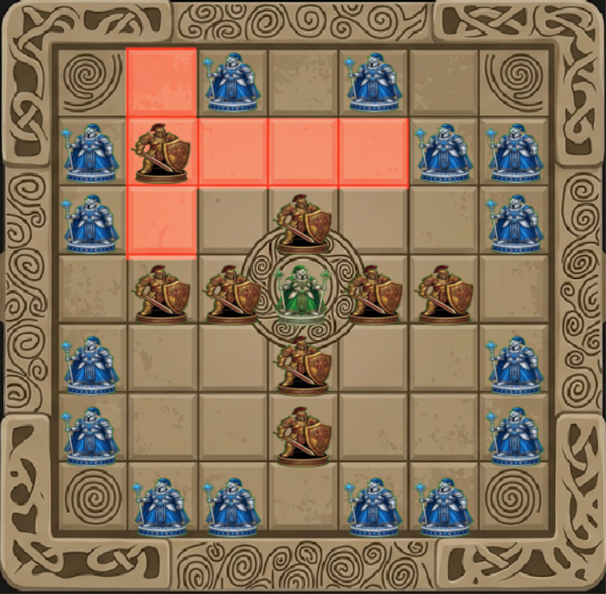

# Brandubh (Audio Enhanced)

An elegant, Python-powered implementation of **Brandubh**, a classic Irish board game belonging to the historic *Tafl* (Hnefatafl) family. This version features an interactive graphical user interface (GUI), customizable AI opponents with variable difficulties, full sound effects, and smooth menu navigation.

---

## 📜 About Brandubh

Brandubh is an ancient Celtic game played on a $7 \times 7$ grid. It simulates an asymmetric battle between two forces:
* **The Defenders (White/King):** Consists of a central King and 4 defenders. Their objective is to safely escort the King to any of the four corner squares of the board.
* **The Attackers (Black):** Consists of 8 attackers surrounding the center. Their objective is to capture the King by surrounding him on all four orthogonal sides.

   

## ✨ Features

* **Asymmetric Gameplay:** Choose to play as either the attacking or defending forces.
* **Minimax AI Opponent:** Play against a customizable computer opponent offering three difficulty settings:
    * **Easy:** Makes completely random moves.
    * **Medium:** Looks 1 ply ahead using basic heuristic evaluations.
    * **Hard:** Uses an advanced depth-3 Minimax search with Alpha-Beta pruning.
* **Immersive Audio System:** Integrated sound effects for game start, movement, captures, king escape, and win/loss states. Implements an automatic audio-suppression layer during AI simulations to ensure clean playback.
* **Suicide / Self-Sandwich Prevention:** Move validation rules dynamically block players from putting their own pieces into an immediate capture setup.
* **Robust Game Loop:** Clean state management preventing invalid clicks or actions during the AI's turn.

---

## 🛠️ Requirements & Installation

Before running the game, ensure you have Python 3.x installed along with the required libraries.

### 1. Install Dependencies
Install the required game-engine and menu packages via `pip`:
```bash
pip install pygame pygame-menu
